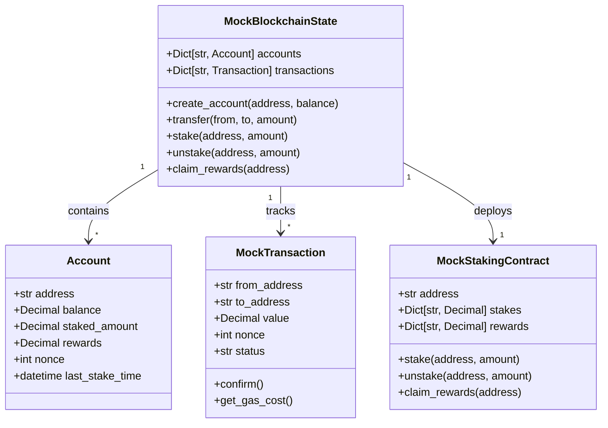
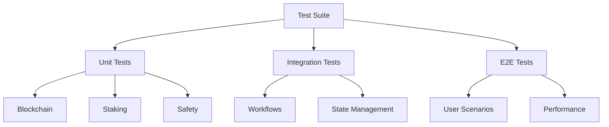
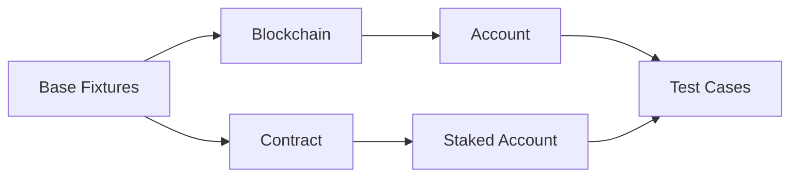
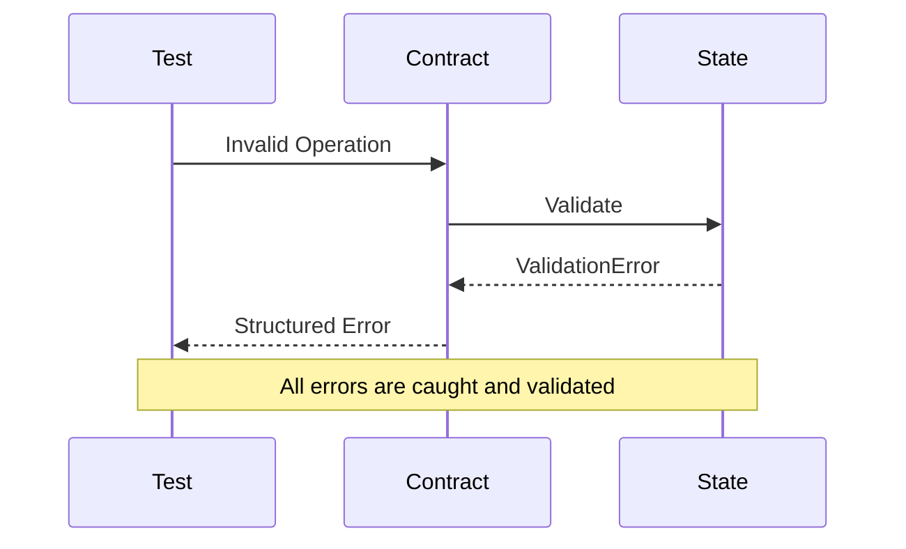

# StakingOptimizer Test Documentation

## Overview
This document describes the test suite architecture and implementation for the StakingOptimizer project. The test framework is designed to ensure comprehensive coverage of the staking optimization functionality while maintaining code quality and reliability.

## System Architecture

### Mock Blockchain Implementation


### Test Organization Pattern


## Test Categories

### Unit Tests
Located in `tests/blockchain/`, `tests/staking/`, and `tests/safety/`:
- `test_mock_state.py`: Blockchain state management
- `test_mock_contract.py`: Staking contract operations
- `test_mock_transaction.py`: Transaction handling
- `test_safety.py`: Safety validations

### Integration Tests
Located in `tests/integration/`:
- `test_workflows.py`: End-to-end workflows
- `test_state.py`: State management
- `test_error_handling.py`: Error scenarios

### End-to-End Tests
Located in `tests/e2e/`:
- `test_scenarios.py`: User journey scenarios
- `test_performance.py`: Performance benchmarks

## Test Patterns and Best Practices

### 1. Fixture Organization


### 2. Error Handling Pattern


## Running Tests

### Prerequisites
1. Python 3.11+
2. Virtual environment activated
3. Dependencies installed

### Test Execution
```bash
# Activate virtual environment
source .venv/bin/activate

# Run all tests with maximum verbosity
pytest tests/ -vvvv

# Run specific test categories
pytest tests/blockchain/ -vvvv  # Unit tests
pytest tests/integration/ -vvvv # Integration tests
pytest tests/e2e/ -vvvv        # End-to-end tests
```

### Test Output
Tests provide detailed output including:
- Test execution flow
- Debug log messages
- Full tracebacks
- Local variables in failures

## Design Principles

### 1. Test Independence
- Each test is self-contained
- Fixtures handle setup/teardown
- No shared state between tests

### 2. Realistic Simulation
- Gas costs are simulated
- Transaction ordering is preserved
- Error conditions match real blockchain

### 3. Comprehensive Coverage
- Happy path scenarios
- Error cases
- Edge conditions
- Performance characteristics

### 4. Maintainable Structure
- Clear test organization
- Reusable fixtures
- Descriptive naming
- Thorough documentation

## Contributing

### Adding New Tests
1. Follow existing patterns
2. Add appropriate fixtures
3. Document test purpose
4. Include error cases
5. Update this README

### Code Review Checklist
- [ ] Tests follow patterns
- [ ] Documentation updated
- [ ] Error cases covered
- [ ] Performance considered
- [ ] Fixtures properly used
